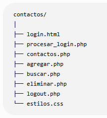
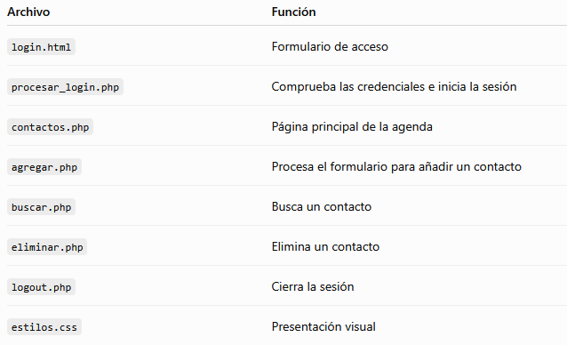

# Agenda de Contactos en PHP

> **PHP. 04/09/26** &mdash; Metodología *Learn by doing*.  
> **Autora:** Blanca &bull; [LinkedIn](https://linkedin.com/in/blancadum)

---

## 1. Descripción del Proyecto

Aplicación web desarrollada en **PHP 8** y **HTML5 Semántico** para la gestión completa de una agenda de contactos personal (operaciones CRUD: Crear, Leer, Actualizar, Buscar y Eliminar).

Dado que el proyecto se sitúa en una etapa de aprendizaje previa a las Bases de Datos relacionales (MySQL/MariaDB), la persistencia de datos se gestiona íntegramente mediante el array superglobal **`$_SESSION`**, reforzando el entendimiento y control del ciclo de vida de las sesiones en PHP.

---

## 2. Estructura de la Aplicación

El flujo de navegación y la interacción entre páginas sigue el organigrama diseñado para la aplicación:



```
index.html (Login)
    │
    ▼ (POST)
procesos/procesar_agenda.php ──[Credenciales Incorrectas]──► index.html
    │
    ▼ [Credenciales Correctas]
contactos.php (Página Principal - Listado)
    ├──► agregar.php ──► procesos/procesar_datosContacto.php ──► contactos.php
    ├──► buscar.php
    ├──► actualizar.php ──► contactos.php
    ├──► eliminar.php ──► contactos.php
    └──► logout.php ──► index.html
```

---

## 3. ¿Qué hace cada archivo?

A continuación se detalla la función y responsabilidad de cada uno de los ficheros del proyecto:



| Archivo | Tipo | Descripción |
| :--- | :---: | :--- |
| **`index.html`** | HTML5 | Página inicial y formulario de acceso. Solo solicita **Username** y **Contraseña** y envía los datos por `POST` al controlador de `procesos/`. |
| **`procesos/procesar_agenda.php`** | PHP | Valida las credenciales. Si son correctas, inicia la sesión, asigna el rol automáticamente, inicializa los arrays de contactos si no existen y redirige a `contactos.php`. |
| **`contactos.php`** | PHP | Menú y pantalla principal. Verifica la sesión activa y muestra los contactos guardados en tarjetas semánticas `<article>`. Ofrece botones directos para editar y eliminar cada contacto. |
| **`agregar.php`** | PHP | Formulario para dar de alta un nuevo contacto (recoge nombre, teléfono y correo electrónico) y enviarlo a procesar. |
| **`procesos/procesar_datosContacto.php`** | PHP | Recibe los datos del nuevo contacto por `POST`, los añade a los arrays correspondientes de la sesión y redirige inmediatamente a `contactos.php`. |
| **`buscar.php`** | PHP | Formulario y lógica de búsqueda por coincidencia exacta (`$nombreBuscado`) dentro del array de la sesión, mostrando los datos del contacto encontrado. |
| **`actualizar.php`** | PHP | Busca un contacto por nombre y, en el mismo archivo, muestra el formulario para cambiar su nombre, teléfono y email. |
| **`eliminar.php`** | PHP | Muestra un formulario para eliminar un contacto por nombre. Utiliza `array_splice()` para mantener los índices ordenados. |
| **`logout.php`** | PHP | Cierra la sesión, vacía `$_SESSION`, destruye la sesión con `session_destroy()` y redirige a `index.html`. |
| **`includes/header.php`** | PHP | Fragmento reutilizable que muestra la cabecera, el nombre del usuario y su rol. |
| **`includes/nav.php`** | PHP | Fragmento reutilizable con el menú de navegación de las páginas internas. |
| **`includes/footer.php`** | PHP | Fragmento reutilizable con el pie de página. |
| **`css/estilosAgenda.css`** | CSS3 | Hoja de estilos compartida que aplica la identidad visual a cabeceras, menús (`nav`), formularios, botones y tarjetas de contacto. |
| **`img/`** | Imágenes | Contiene el favicon, el avatar predeterminado y las fotos de los contactos. |

---

## 4. Almacenamiento de Datos en Sesión

Los datos de los contactos se estructuran en **cuatro arrays numéricos paralelos** dentro de `$_SESSION`:

```php
$_SESSION["nombre"]   = []; // Nombres de los contactos
$_SESSION["telefono"] = []; // Teléfonos de los contactos
$_SESSION["email"]    = []; // Correos electrónicos
$_SESSION["foto"]     = []; // Rutas relativas a las fotos de perfil (ej. img/contacto_1_1788858104.png o img/avatar.svg)
```

De este modo, el contacto en la posición `0` está compuesto por:
* `$_SESSION["nombre"][0]`
* `$_SESSION["telefono"][0]`
* `$_SESSION["email"][0]`
* `$_SESSION["foto"][0]`

Para los datos del usuario autenticado se emplean variables de sesión dedicadas, evitando colisiones con el listado de contactos:
* `$_SESSION["nombre_usuario"]`: Nombre real de la persona (ej: *Blanca*).
* `$_SESSION["usuario"]`: Nombre de usuario / username (ej: *admin*).
* `$_SESSION["rol"]`: Rol del perfil (ej: *Administrador* o *Usuario*).

---

## 5. Cómo ejecutar el proyecto en local

1. Asegúrate de tener instalado **WampServer** (o XAMPP) con Apache y PHP 8+ activos (icono en verde).
2. Clona o copia la carpeta `agenda` dentro del directorio web del servidor:
   ```text
    C:\wamp2\www\proyectos\agenda\
   ```
3. Abre tu navegador web y accede a través de la URL de Apache (no uses `file:///`):
   ```text
    http://localhost/proyectos/agenda/
   ```
4. Utiliza los datos de acceso de prueba:
    * **Username:** `admin` *(o cualquier usuario no vacío)*
    * **Contraseña:** `1234`

El rol no se solicita en el formulario. Se asigna automáticamente: `admin` recibe el rol **Administrador** y el resto de usuarios recibe el rol **Usuario**. Después, el nombre de usuario y el rol aparecen en la cabecera.

---

## 6. Buenas Prácticas y Estándares Aplicados

* **Control de Seguridad en cada vista:** Redirección automática al login si no existe una sesión válida iniciada (`!isset($_SESSION["usuario"])`).
* **Web Semántica:** Estructura basada en `<header>`, `<nav>`, `<main>`, `<section>`, `<article>` y `<footer>`.
* **Seguridad Básica:** Sanitización de salidas con `htmlspecialchars()` para prevenir ataques XSS.
* **Sesiones y cookies:** `session_start()` inicia o recupera la sesión. PHP utiliza la cookie `PHPSESSID` para identificarla, pero los contactos se guardan en el servidor dentro de `$_SESSION`.
* **Documentación PHPDoc:** Todos los archivos PHP incluyen bloques de documentación estándar con etiquetas `@author Blanca` y `@version 1.0`.
* **Reindexación de Arrays:** Uso de `array_splice()` en lugar de `unset()` simple para evitar errores de índice en bucles `for` tras una eliminación.
* **Código reutilizable:** Las partes comunes se separan en `includes/header.php`, `includes/nav.php` y `includes/footer.php`, que se cargan mediante `include` o `include_once` en las páginas visuales.

